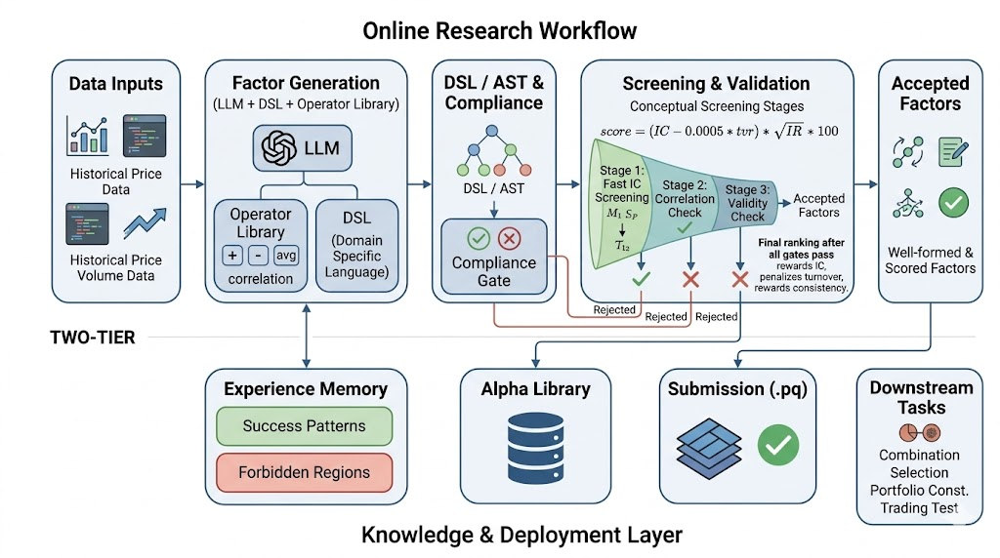

# Auto Alpha Research Factory v1

An autonomous quantitative alpha research system built for the **Scientech Labs Equity Alpha Research 2026** competition. It covers the full pipeline: historical price/volume ingestion, factor generation (LLM and/or evolutionary search over a DSL), compliance checks, evaluation (IC / IR / turnover / concentration), local leaderboard storage, and Parquet submission packaging.

## Architecture

The repo follows a **two-tier** mental model: an **online research workflow** (generate → parse → comply → screen → score) and a **knowledge & deployment layer** (experience memory, alpha library, `.pq` submission, downstream combination and backtests). The figure below matches this layout.



| Layer | Role in this codebase |
|--------|------------------------|
| **Data inputs** | `prepare_data.py` (`DataHub`): loads 1-min OHLCV Parquet, resamples to 15-min bars; `core/datahub.py` provides aligned loaders for evaluation and submission windows. |
| **Factor generation** | `factor_idea_generator.py` (LLM-assisted ideas), `research_loop.py` + `core/genalpha.py` (EA / parent-based mutation), with operators from `operator_catalog.py` and formulas parsed by `formula_parser.py`. |
| **DSL / AST & compliance** | Formulas compile to an AST and are checked by `compliance_guard.py` (no `resp` / `trading_restriction` in formulas, bounds, structure). |
| **Screening & validation** | `quick_test.py` / `evaluate_alpha.py` compute IC, IR, turnover, concentration; gates align with the competition score `score = (IC - 0.0005 * tvr) * sqrt(IR) * 100` (see Metrics). |
| **Experience memory** | Conveyed practically by `leaderboard.json` and research logs: successful vs rejected patterns inform the next iteration (top parents for EA/LLM). |
| **Alpha library & submission** | `leaderboard.py` persists candidates; `core/submission.py` packages passing alphas as 15-min `.pq` grids. |
| **Downstream** | `core/combiner.py` (ensembles), `simulate_strategy.py` (strategy simulation), and the UI via `server.py`. |

## Competition Overview

| Item | Detail |
|------|--------|
| Data | 1-min OHLCV bars (2022–2024), resampled to 15-min |
| Submission format | 15-min frequency alpha grid (Parquet) |
| Scoring | `score = (IC - 0.0005 * tvr) * sqrt(IR) * 100` |
| IC target | > 0.6 (scaled ×100) |
| IR target | > 2.5 |
| Turnover target | tvr < 400 |
| Concentration | maxx/minn < 50 bps, avg < 20 bps |
| In-Sample phase | Mar 16 – Jun 10, 2026 (max 200 submissions) |
| OOS phase | May 15 – Jun 10, 2026 (max 20 submissions) |
| Final presentation | June 5, 2026 |

## Project Structure

```
.
├── core/
│   ├── datahub.py          # Loaders & calendar alignment for eval / submission
│   ├── evaluator.py        # IC / IR / tvr / concentration metrics
│   ├── genalpha.py         # Evolutionary alpha generator (DSL + mutation)
│   ├── submission.py       # Submission packaging & gate checks
│   └── combiner.py         # Multi-factor ensemble combiner
├── frontend/               # Vite/React dashboard UI
├── factors/                # Saved factor formula files
├── submit/                 # Packaged submission artifacts (*.pq excluded from git)
├── outputs/                # Backtest outputs
├── prepare_data.py         # DataHub: 1-min → 15-min cache
├── leaderboard.py          # Local leaderboard tracker
├── research_loop.py        # Autonomous EA/LLM research loop
├── evaluate_alpha.py       # CLI: evaluate a single alpha
├── factor_idea_generator.py # LLM-assisted factor ideation
├── formula_parser.py       # DSL → AST parser
├── compliance_guard.py     # Leakage & restriction checker
├── quick_test.py           # Formula evaluation & metric computation
├── simulate_strategy.py    # Strategy simulation
└── server.py               # Flask backend for the UI & API
```

## DSL Formula Language

Alphas are expressed in a proprietary DSL that maps to an AST evaluated over 15-min bar data.

- **Time-series**: `ts_mean`, `ts_std`, `ts_corr`, `ts_rank`, `ts_decay_linear`, `delta`, `delay`
- **Cross-sectional**: `rank`, `zscore`, `demean`, `scale`
- **Math**: `abs`, `log`, `sign`, `ifelse`, `+`, `-`, `*`, `/`

Available fields: `open`, `high`, `low`, `close`, `volume`, `vwap`, `amount`

## Quick Start

```bash
# 1. Activate environment (example)
conda activate alphaclaw

# 2. Backend (Flask API on http://127.0.0.1:8080)
python server.py

# 3. Frontend (separate terminal)
cd frontend && npm install && npm run dev
```

See `frontend/README.md` for UI-specific notes and any bundled `start` scripts.

## Evaluate & Submit a Factor

```bash
# Evaluate a formula string
python evaluate_alpha.py --formula "rank(ts_mean(close/vwap, 20))" --name alpha_001

# Package for submission (checks quality gates before writing .pq)
python -m core.submission
```

## Compliance Rules

- **No future data**: `resp` and `trading_restriction` fields are forbidden in factor formulas.
- **Coverage**: Alpha grid must cover every trading day in the evaluation window.
- **Bounds**: Output must be finite and bounded; `zscore` or `scale` recommended as final step.

## Metrics Reference

| Metric | Formula | Gate |
|--------|---------|------|
| IC | mean daily Pearson corr(alpha, resp) × 100 | > 0.6 |
| IR | IC.mean() / IC.std() × √252 | > 2.5 |
| tvr | mean daily turnover | < 400 |
| maxx | max single-stock weight (bps) | < 50 |
| Score | `(IC - 0.0005×tvr) × √IR × 100` | higher is better |
