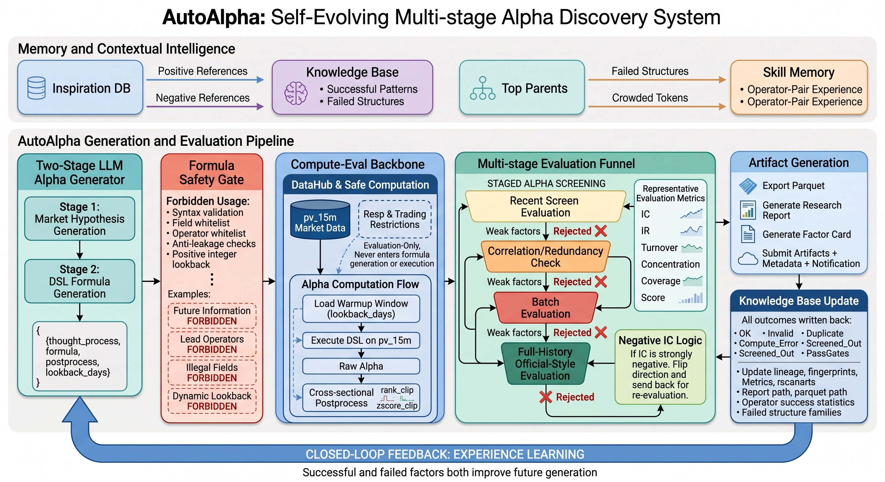

# AutoAlpha v3



AutoAlpha v3 is an AI-assisted intraday futures alpha research factory for DCE commodity futures. It is not only a combo-result dashboard: the core of the project is a closed-loop factor mining system that turns research hypotheses into DSL formulas, validates them, evaluates them on 15-minute DCE contract data, stores the research memory, and then studies single-factor and multi-factor OOS behavior.

The display frontend is currently used for local testing, live-trading style internal checks, and futures mining experiments. It is not publicly released for now.

## Current Futures Adaptation

- Active branch: `fut`, based on upstream `v3`.
- Raw DCE data: `/mnt/v0a2d/jiayi/future/dce`.
- Order-flow reconstruction data: `/mnt/nvme2/syin/OFR`.
- Existing futures alpha library: `/mnt/v0a2d/jiayi/future/alpha`.
- Active products: `C`, `LH`, `M`.
- New factors are evaluated by product, compared against existing futures alpha files for low correlation, visualized through CSV/JSON/PNG correlation reports, and exported in the same date/product parquet layout when retained.
- Every project update must be recorded in `frontend/src/data/devTimeline.ts` through `scripts/add_timeline_entry.py`; Setting now shows the Timeline.
- Paper inspirations use arXiv q-fin futures queries plus OpenAlex/curated fallback. The conversion rule follows the referenced paper-pipeline note: search structured metadata first, extract only explicit formulas/metrics/mechanisms, then translate into OFR-compatible variables without hallucinating paper details.

## Research Goal

AutoAlpha v3 was built around one practical question:

> Can an agentic research loop discover, test, remember, and combine intraday alpha factors with enough structure and auditability to be useful for real quant research?

The current implementation focuses on:

- generating interpretable factor hypotheses from manual prompts, imported research notes, and LLM reasoning;
- translating hypotheses into a constrained DSL formula language;
- parsing formulas into ASTs so the system can inspect fields, operators, windows, and structure;
- rejecting leakage-prone or invalid formulas before expensive evaluation;
- computing factor files and futures tick h60 metrics including raw IC/RankIC, raw ICIR, market breadth, OOS stability, and novelty versus existing alpha files; turnover is kept as a diagnostic, not a pass/fail gate;
- saving passing and failing attempts into a knowledge base for later retrieval;
- using RAG and generation experience to steer the next mining rounds;
- combining mined factors with rank-based ensembles and ML meta-models under chronological train/validation/OOS splits;
- serving a compact, read-only internal frontend for research review without exposing private raw data.

## End-to-End Mining Loop

The v3 loop is designed as a research factory rather than a single model call.

1. **Inspiration intake**
   - Manual factor prompts, notes under `manual/`, archived reference implementations under `examples/legacy_factor_research/`, and prior successful factors are converted into structured inspiration records.
   - Each inspiration can be summarized, tagged, sampled, and later tied back to generated factors.

2. **Hypothesis and formula generation**
   - `llm_client.py`, `pipeline.py`, and `loop.py` generate research hypotheses and DSL formulas.
   - Prompts include the target metric, allowed fields/operators, known good structures, failure feedback, and selected RAG context.

3. **DSL parsing and structural control**
   - Formulas are parsed into ASTs by `formula_parser.py`.
   - The system can collect fields, operators, numeric windows, structural fingerprints, and parent-child formula relationships.
   - This makes factors auditable as formula trees instead of opaque strings.

4. **Validation and leakage guard**
   - `formula_validator.py` and `compliance_guard.py` enforce syntax validity, operator whitelists, field whitelists, no `resp` usage, no `trading_restriction` usage in factor construction, and bounded output behavior.

5. **Evaluation and gate checks**
   - `quick_test.py`, `core/evaluator.py`, and `core/futures_alpha.py` compute factor values, broadcast them to the OFR tick `ext` grid, evaluate 15s h60 raw IC/ICIR, compare against existing alpha files, and package passing factors in the same native parquet layout.
   - Factors that pass gates are copied to submit-ready outputs; runtime parquet files remain outside Git.

6. **Memory update**
   - `knowledge_base.py` records formula, metrics, generation, parents, inspiration IDs, structural fingerprint, status, and research paths.
   - Passing factors become future RAG anchors; failed families can be down-weighted or treated as exhausted.

7. **Model and combo lab**
   - `rolling_model_lab.py` studies chronological OOS behavior, low-correlation factor subsets, rank ensembles, and ML meta-models.
   - Results are exported as compact JSON summaries for the frontend and full runtime artifacts for local research.

## RAG And Research Memory

The RAG layer is intentionally research-oriented. It is not a generic document chat system; it retrieves compact evidence that can change the next factor generation step.

Current memory sources include:

- passing factor records with formula, score, h60 raw IC, ICIR, diagnostic turnover, generation, parent IDs, and thought process;
- failed or exhausted structural families through formula fingerprints;
- recent archived generation summaries under `docs/notes/generation/`;
- inspiration records from manual prompts and imported notes;
- leaderboard-style top factors used as strong anchors;
- combo-lab summaries used to understand factor complementarity and redundancy.

The project also documents planned RAG upgrades in `docs/rag/RAG_TODO.md`, including semantic retrieval for passing factors, dynamic inspiration quality feedback, finer-grained structural fingerprints, historical experience retrieval, and Stage-1 hypothesis outcome feedback.

## Compact Display Architecture

Raw parquet files and local databases are large and private, so the internal display frontend uses a compact deployment design.

- The full research workspace lives at `/Volumes/T7/autoalpha_v3`.
- The display deployment lives at `/Volumes/T7/autoalpha_v3_display`.
- `server.py` compacts heavy model-lab summaries by keeping public-safe metadata, selected metrics, method cards, small curves, correlations, and display records while stripping raw formulas or bulky arrays where needed.
- The display server serves built frontend assets and read-only JSON snapshots.
- Mutating endpoints are disabled in display mode.

The display layer is intended for local/internal review of the mining process, factor research logic, live-trading style checks, and futures migration experiments. It is not described as a public portal at this stage.

## Data Basis

The active data basis is DCE futures order-flow reconstruction. `prepare_data.py`
loads OFR parquet files, aggregates contract records to 15-minute bars, builds a
contract universe, and creates next-day contract returns for local evaluation.
`resp` and `trading_restriction` remain evaluation-only fields and are forbidden
in factor construction.

| Data slice | Location | Notes |
| --- | --- | --- |
| Raw DCE files | `/mnt/v0a2d/jiayi/future/dce` | Original futures data reference. |
| OFR bars | `/mnt/nvme2/syin/OFR` | Source for 15-minute contract bars and order-flow fields. |
| Existing alpha library | `/mnt/v0a2d/jiayi/future/alpha` | Used for novelty/correlation checks and format matching. |
| Runtime outputs | `/mnt/nvme2/syin/data/outputs` | Local cache, quick-test reports, correlation plots, and fallback future-alpha exports. |

Allowed factor fields include OHLC/VWAP/trade count plus futures-specific
`open_interest`, `delta_oi`, `buy_volume`, `sell_volume`, `open_volume`,
`close_volume`, `market_ofi`, `add_ofi`, `cancel_ofi`, `book_ofi`,
`book_imbalance`, `spread`, and `cvd`.

## Current Mining Results

As of the latest local snapshot from `knowledge.json` updated at
`2026-04-28T18:05:19`:

| Area | Result |
| --- | ---: |
| Total tested factor records | 176 |
| In-sample passing factors | 16 |
| Factors with recorded 2024 OOS metrics | 17 |
| Factors passing both in-sample and 2024 OOS gates | 7 |
| Passing generations | generation 0 to 1 |
| Best in-sample single-factor Score | 570.95 |
| Best 2024 OOS single-factor Score | 479.83 |

Single-factor mining is evaluated in two stages:

1. **Discovery / in-sample:** 2022-2023 data is used to screen formulas and
   decide whether a factor passes the official-like gates.
2. **OOS overfit check:** 2024 is then evaluated as a held-out year. These
   metrics are recorded for review and frontend display, but `oos_used_for_feedback`
   is `false`, so 2024 is not used to fit weights, select formulas, or steer
   the next factor-generation prompt.

Representative factors from the current snapshot:

| Factor | IS Score | IS IC | IS IR | IS TVR | 2024 OOS Score | OOS IC | OOS IR | OOS TVR | OOS Gate |
| --- | ---: | ---: | ---: | ---: | ---: | ---: | ---: | ---: | --- |
| `v3sys_20260427_103145_01` | 570.95 | 2.2586 | 6.5275 | 47.65 | 471.91 | 2.1955 | 4.7166 | 45.20 | Pass |
| `v3sys_20260427_111852_05` | 550.52 | 2.1664 | 6.5621 | 34.67 | 479.83 | 2.1860 | 4.8931 | 33.70 | Pass |
| `v3sys_20260427_103145_02` | 474.01 | 1.8938 | 7.0912 | 227.44 | 317.83 | 1.5299 | 5.0484 | 230.67 | Pass |
| `v3v2_20260427_114258_08` | 309.28 | 1.4001 | 5.9668 | 267.95 | 0.00 | 0.6443 | 1.9710 | 264.35 | Fail |

```text
v3sys_20260427_103145_01
formula: cs_rank(-1 * (ts_ema(close_trade_px,12)/ts_ema(close_trade_px,48) - 1))
IS:  Score 570.95 | IC 2.2586 | IR 6.5275 | TVR 47.65
OOS: Score 471.91 | IC 2.1955 | IR 4.7166 | TVR 45.20
```

The fourth row illustrates why the OOS split matters: a factor can pass the
2022-2023 discovery gates but fail the 2024 held-out IR gate, which flags a
possible overfit or period-specific structure.

## Latest OOS Combo And Fusion Snapshot

The latest computed combo lab uses chronological splits:

- Train: `2022-01-04` to `2023-12-29`
- Validation: only inside the 2022-2023 in-sample block
- Mock OOS test: `2024-01-02` to `2024-12-31`
- No 2024 labels are used for fitting weights, model parameters, method selection, or validation.

Current `model_lab/latest_summary.json`:

| Field | Value |
| --- | ---: |
| Selected factors | 10 |
| Train rows | 2.15M |
| Validation rows | 0.21M |
| 2024 OOS rows | 1.24M |
| Best model | `CausalDecayFactorTransformerStackModel` |
| 2024 OOS Score | 7370.52 |
| 2024 OOS IC | 11.2125 |
| 2024 OOS IR | 43.7387 |
| 2024 OOS TVR | 135.76 |
| 2024 OOS long-short PnL | 2.4783 |
| 2024 OOS long-only PnL | 1.3246 |

Top current OOS combo models:

| Model | Train Score | Val Score | 2024 OOS Score | OOS IC | OOS IR | OOS TVR |
| --- | ---: | ---: | ---: | ---: | ---: | ---: |
| `CausalDecayFactorTransformerStackModel` | 14540.84 | 14773.80 | 7370.52 | 11.2125 | 43.7387 | 135.76 |
| `FactorTokenTransformerRidgeStackModel` | 16698.50 | 17928.27 | 6929.42 | 10.8103 | 41.6085 | 135.52 |
| `LightGBMMetaModel` | 20513.20 | 20480.11 | 6855.68 | 10.7312 | 41.3275 | 133.89 |
| `MLPRegressorMetaModel` | 17194.44 | 18365.98 | 6418.81 | 10.4096 | 38.5115 | 132.56 |

The leading model is a leakage-guarded factor Transformer stack. It trains only on the visible 2022-2023 block and uses 2024 strictly as OOS evaluation. The frontend reports OOS PnL diagnostics instead of plotting misleading top-bottom prediction spreads:

- long-short cumulative PnL with Max DD on a secondary axis;
- pure long-only cumulative PnL with Max DD on a secondary axis;
- method cards with Train/Val/OOS metrics, method descriptions, TVR, and leakage notes;
- full-factor versus low-correlation factor-basket comparison where available.

The current correlation snapshot tracks 16 passing factors. Under an absolute
correlation threshold of `0.70`, the low-correlation selector keeps 9 factors
with total in-sample score `2207.23`; this subset is used for redundancy checks
and follow-up combo experiments.

## What Is Included

- LLM-assisted factor idea generation and prompt memory.
- DSL formula parsing, AST inspection, formula fingerprints, and structure-aware mutation.
- Leakage and compliance checks before evaluation.
- Local knowledge base for tested factors, gate status, scores, IC/IR/TVR, parentage, inspiration source, and research notes.
- RAG context for passing factors, recent generation experience, and inspiration records.
- Rolling model lab and exploratory OOS combo lab.
- Full-factor and low-correlation combo comparisons on 2024 mock OOS data.
- ML benchmarks over raw/rank/z-score factor features: Ridge, RandomForest, ExtraTrees, HistGradientBoosting, LightGBM, and MLP.
- DL/sequence benchmarks including factor-token Transformer and causal-decay factor Transformer stack models.
- Model Fusion Lab with stacking/blending candidates and a 25-model output-correlation heatmap.
- OOS long-short and long-only PnL / Max DD diagnostics.
- React + Recharts frontend for mining progress, factor records, inspirations, RAG roadmap, and combo cards.
- Display-only Flask server for compact, internal-review JSON snapshots and static assets.

## Repository Layout

```text
.
├── core/                      # data loading, evaluator, submission utilities
├── factors/                   # factor formula library and prompts
├── frontend/                  # React/Vite dashboard
├── manual/                    # manual factor prompts and helper scripts
├── research/                  # configs, research helpers, lightweight run snapshots
│   └── runs/                  # archived factor-card/report snapshots
├── scripts/                   # maintenance, mining, and snapshot helpers
├── deploy/                    # display deployment utilities
├── docs/                      # requirements, RAG roadmap, notes, summaries
├── assets/images/             # README and documentation images
├── examples/legacy_factor_research/
│   └── 数据及因子/             # legacy/reference factor implementations
├── server.py                  # live Flask API + frontend server
├── loop.py                    # closed-loop factor mining orchestration
├── pipeline.py                # idea -> formula -> evaluate workflow
├── rolling_model_lab.py       # OOS combo lab and ML/meta-model experiments
├── runtime_config.py          # runtime config loader/saver
├── prepare_data.py            # data hub and raw-data alignment entrypoint
└── requirements.txt           # Python dependency baseline
```

Large runtime outputs are intentionally excluded from Git:

- raw and derived parquet files (`*.pq`, `*.parquet`)
- local SQLite databases (`*.db`, `*.sqlite*`)
- generated submit/output/model-lab artifacts
- frontend `node_modules` and `dist`
- logs, pid files, Python caches, macOS AppleDouble files

## Quick Start

### 1. Python environment

```bash
cd /Volumes/T7/autoalpha_v3
python -m venv .venv
source .venv/bin/activate
pip install -r requirements.txt
```

The local machine currently uses Conda Python for large experiments. If using Conda:

```bash
conda activate <your-env>
pip install -r requirements.txt
```

### 2. Frontend dependencies

```bash
cd /Volumes/T7/autoalpha_v3/frontend
npm install
npm run build
```

### 3. Live research server

```bash
cd /Volumes/T7/autoalpha_v3
python server.py
```

The live server defaults to:

- Backend/API: `http://127.0.0.1:8080`
- Frontend path: `http://127.0.0.1:8080/v3/`

### 4. Display-only server

```bash
cd /Volumes/T7/autoalpha_v3_display
./start_display.sh
```

The display server is read-only and serves:

- Local display: `http://127.0.0.1:8080/v3/`
- Public access: not released for now.

## Running Research Jobs

Closed-loop mining:

```bash
python run.py
```

Current 10-factor combo lab:

```bash
python rolling_model_lab.py \
  --target-valid 10 \
  --ideas-per-round 0 \
  --max-rounds 0 \
  --allow-partial
```

Low-correlation factor-basket lab:

```bash
python rolling_model_lab.py \
  --run-low-corr-experiment
```

The lab exports compact summaries under `model_lab/` and submit-ready outputs under `submit/`. These runtime artifacts are excluded from source control.

## Frontend Notes

The dashboard is built with:

- React 18
- TypeScript
- Vite
- Tailwind CSS
- Recharts
- lucide-react

The UI is organized around:

- AutoAlpha Research Cockpit
- Prompt Lab
- Loop control and live logs
- Factor records and factor cards
- Inspiration browser
- RAG roadmap and development timeline
- Exploratory OOS Combo Lab
- Combo Card drilldowns

For production builds under `/v3`, `frontend/vite.config.ts` reads `AUTOALPHA_APP_BASE` and defaults to `/v3/`.

## Data And Secret Policy

This repository is meant to publish project code, not private runtime data. Do not commit:

- raw market parquet files
- generated submission parquet files
- local SQLite databases
- API keys or `.env` files
- process logs with private endpoints
- `node_modules`

Before publishing, run:

```bash
git status --short
git ls-files | rg '(\.pq$|\.parquet$|\.db$|\.sqlite|\.env|node_modules|__pycache__)'
```

The expected result for the second command is empty.

## Deployment Snapshot Workflow

1. Build frontend in `/Volumes/T7/autoalpha_v3/frontend`.
2. Sync `frontend/dist` to `/Volumes/T7/autoalpha_v3_display/frontend/dist`.
3. Write compact JSON snapshots to `/Volumes/T7/autoalpha_v3_display/data/snapshots`.
4. Copy selected display-safe outputs to `/Volumes/T7/autoalpha_v3_display/data/submit`.
5. Restart `/Volumes/T7/autoalpha_v3_display/start_display.sh`.

The snapshot API is intentionally read-only. Mutating endpoints return `403` in display mode.

## Contact

I welcome conversations about this project, recent progress, collaboration, and internship opportunities.

- Email: [yinelon@gmail.com](mailto:yinelon@gmail.com)
- LinkedIn: [Shuo Yin](https://www.linkedin.com/in/shuoyin/)

## License And Competition Data

The code can be shared in the project repository. Competition data, generated parquet outputs, credentials, and local databases remain outside Git because they may be large, private, or environment-specific.
