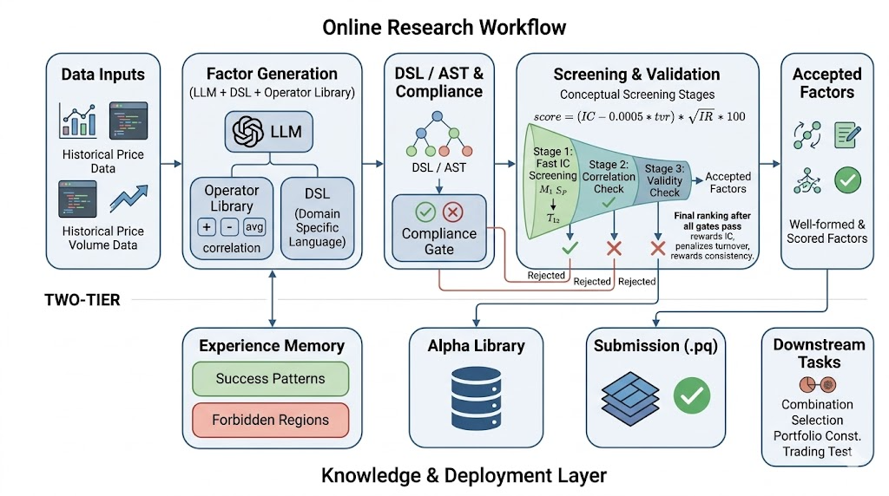

# LLM 因子挖掘现状总结



本文基于仓库当前代码、`leaderboard.json`、`llm_mining/mining_log.jsonl` 与现有提交产物整理，关注的核心不是比赛规则本身，而是“LLM 在这个项目里到底怎样参与因子挖掘”“当前生成逻辑和数学基础是什么”“链路已经落到什么程度”。文中的“当前”特指 2026 年 4 月 10 日这个时间点可观察到的实现与运行状态。

## 一、先给结论

这套系统已经不是一个停留在概念层的“LLM 想点子工具”，而是一条完整的研究流水线。自然语言研究假设会先被转成 DSL 因子候选，随后经过语法解析、白名单校验、无泄漏检查、15 分钟频率实算、IC/IR/Turnover 打分和提交格式检查，最后再决定是否进入因子库与提交目录。也就是说，LLM 负责提出候选，程序负责裁决优劣。

但如果从结果而不是从工程完备度来判断，当前系统仍处于“链路已打通，在线生成和有效率还不稳定”的阶段。最好的可提交因子已经出现，但它们仍以相对简单的短周期价格均值回复结构为主；与此同时，2026 年 4 月 10 日的日志显示，上游模型接口多次超时或断连，实际生成过程频繁回退到离线公式库。因此，更准确的定位是“带有 LLM 接口、回退机制和审计日志的自动化因子研究框架”，而不是“已经稳定依赖在线 LLM 持续产出高质量新因子的系统”。

## 二、LLM Application

当前实现有一个很清晰的分工原则：LLM 只负责研究探索，不负责评分与合规。`factor_idea_generator.py` 和 `research/auto_agent.py` 负责把 prompt、已有优质因子和研究约束转成新的候选公式；`quick_test.py`、`formula_validator.py`、`compliance_guard.py` 与 `core/evaluator.py` 负责对候选公式做确定性裁决；`leaderboard.json` 和 `llm_mining/mining_log.jsonl` 则分别承担结果记忆和生成审计的职责。

这个边界非常重要，因为它让“生成”与“裁决”分开了。LLM 可以尝试更有创造性的结构，但它并不能直接决定一个因子是否被接受。最终能进入因子库的，只能是那些在统一评测口径下通过质量门的公式。

## 三、DSL to AST

当前系统不是直接对字符串做粗糙替换，而是先通过 `formula_parser.py` 把 DSL 公式解析成 AST，也就是抽象语法树。解析器采用的是比较标准的递归下降方式，语法骨架可以简化为：

```text
expr   -> term (('+' | '-') term)*
term   -> unary (('*' | '/') unary)*
unary  -> '-' unary | primary
primary -> NUMBER | IDENT | func_call | '(' expr ')'
func_call -> IDENT '(' arg_list ')'
```

解析后，树里只有五种节点类型：`NumberNode`、`FieldNode`、`FuncCallNode`、`BinaryOpNode` 和 `UnaryOpNode`。这种设计非常克制，但已经足够支撑后续的验证、归纳和变异。

数学上，一个因子可以统一写成

`alpha_{t,i} = F_theta(X_{1:t,i}, X_{t,:})`

其中 `i` 是股票，`t` 是 15 分钟时间点，`X_{1:t,i}` 表示单只股票到当前为止的历史路径，`X_{t,:}` 表示当前时刻所有股票构成的横截面。AST 的作用，就是把这个复合函数 `F_theta` 分解成一系列局部变换，让系统知道“这个因子由哪些输入、哪些变换、以什么顺序”构成。

例如，当前头部因子 `cs_rank(-ts_zscore(close_trade_px, 15))` 在结构上可以理解为：

```text
cs_rank
└── unary(-)
    └── ts_zscore
        ├── close_trade_px
        └── 15
```

这棵树表达的是一条非常清晰的信号链。最底层 `close_trade_px` 是原始观测；`ts_zscore(close_trade_px, 15)` 计算的是当前价格相对近 15 个 bar 自身均值的标准化偏离；前面的负号把“偏离过高”翻译成“更偏向回落”的信号方向；最外层的 `cs_rank` 再把所有股票在同一时刻放到同一个可比较的截面秩上。也就是说，因子不是一句难懂的字符串，而是一棵有明确含义的变换树。

当前代码里已经显式提供了几种结构抽取能力。`collect_fields` 会收集一个公式使用了哪些字段，`collect_operators` 会收集它调用了哪些算子，`extract_nodes` 会把数值节点、字段节点、函数节点和二元运算节点抽出来，作为后续变异与编辑的候选对象。换句话说，系统现在已经能够“看见结构”，只是还没有把高层语义归纳封装成单独的分类器模块。

在这套基础上，一个因子其实可以被归纳为五个维度：输入字段、时间窗口、主导算子类别、树的拓扑形状以及最终方向。形式化一点，可以把一个因子描述成

`D(f) = (Fields, Horizon, Ops, Topology, Sign)`

其中 `Fields` 决定它主要依赖价格、成交量还是量价组合；`Horizon` 决定它是超短期、短期还是更平滑的中期结构；`Ops` 决定它主要在刻画均值回复、动量、波动、相关性还是条件切换；`Topology` 决定它是单链式因子、双分支组合因子还是条件分段因子；`Sign` 则说明它最终是顺势解释还是反转解释。

这类归纳不是装饰性的，它直接影响研究判断。比如 `cs_rank(-ts_zscore(close_trade_px, 15))` 可以被读成“单字段价格因子、单窗口、先做时间序列标准化再做截面排序、方向为负”，因此很典型地属于短周期价格均值回复。再例如日志中的 `cs_rank(ts_decay_linear(delta(close_trade_px, 5) * volume, 10))`，结构上则是“价格变化与成交量交互、先抽取 5-bar 动量，再用 10-bar 衰减平滑，最后做截面排名”，因此更接近一种由成交量确认的短期趋势或冲击延续因子。

需要说明的是，这里的“因子家族归纳”是基于当前 AST 结构所做的严谨解释，而不是说仓库里已经有一个现成模块自动输出“这是均值回复”或“这是量价背离”。现在已经落地的，是结构抽取与结构编辑；更高层的研究语义，可以稳定地从这些结构信息中推导出来。

## 四、迭代过程

如果把整个挖掘过程看成一个优化问题，它并不是在连续参数空间里做梯度下降，而是在离散的符号空间里搜索：

`maximize S(f) = Score(alpha(f))`

subject to

`syntax(f) = valid`

`compliance(f) = pass`

以及后续的 IC、IR、Turnover、Concentration、Coverage 等约束。

这里真正被优化的对象不是某个参数向量，而是公式树 `f` 本身。因此，系统的迭代方式也不是“微调权重”，而是“改树”。

第一层迭代来自模板初始化。`factor_idea_generator.py` 中预置了均值回复、动量、量价、波动率和复合结构模板，例如 `ts_mean(close_trade_px, {w1}) / close_trade_px - 1`、`ts_corr(close_trade_px, volume, {w1})` 或带 `ifelse` 的条件表达式。这些模板本质上是把一些常见研究假设离散化，给搜索提供合理起点，而不是从完全随机的表达式开始。

第二层迭代来自参数变异。`mutate_parameter` 会在 AST 里寻找 `NumberNode`，并对窗口长度做局部扰动。代码上的变化幅度大致相当于在原窗口附近做一个 `[-20%, +20%]` 的随机搜索，再保证最小值不小于 1。数学上，这一步是在搜索“研究时间尺度”，例如比较 10-bar、15-bar、20-bar 哪个窗口更适合当前异常定义。

第三层迭代来自算子变异。`mutate_operator` 会在二元运算节点和函数调用节点上做局部替换，并尽量保持替换发生在同类算子、相同参数个数的范围内。这意味着系统不是随便乱改，而是在保持结构骨架大体不变的前提下，改变局部变换方式。直观上，这相当于把“同一种研究思路”换一个数学表达形式，看看信号是否更稳。

第四层迭代来自字段变异。`mutate_field` 会把叶子节点从一个原始字段切换到另一个字段，例如从 `close_trade_px` 换成 `volume`、`dvolume` 或 `vwap`。这一步对应的是更换观测来源，也就是把“价格异常”改成“量能异常”或“价格相对 VWAP 偏离”。

第五层迭代来自交叉。当前 `crossover_formulas` 的实现还比较保守，它没有做经典遗传编程里那种深层子树嫁接，而是把两个父代因子通过根节点上的 `+`、`-`、`*`、`/` 拼成新的复合公式。严格来说，这更接近“信号组合”而不是“深层结构重组”，但在量化因子场景中依然有意义，因为很多有效 alpha 的确来自两个中等强度信号的组合。

第六层迭代来自 LLM 提示词本身。当前 prompt 不只是让模型“给一个公式”，还会同时喂入研究目标、已有高分因子、正交性要求和结构深度要求。在 `research_loop.py` 中，系统甚至会随着迭代次数逐步提高 `depth_hint`，也就是早期偏向简单稳健结构，中期再尝试更复杂的组合。这背后的研究策略很明确：先用浅层结构验证信号方向，再逐渐增加表达能力，而不是一开始就搜索很深、很脆弱的复杂公式树。

最后，父代选择也不是随机的。当前研究循环会优先从 `leaderboard.json` 中挑选通过质量门且 `Score` 最高的若干因子作为父代，再围绕它们做变异、交叉或正交化扩展。这意味着系统已经具备一个最基本的经验回流机制：好的因子会提高自己被再次利用的概率，从而影响下一轮搜索分布。


## 五、验证与合规

AST 只是候选表达式，真正让一棵树进入因子库的，是后面的验证与评分。当前 `formula_validator.py` 的第一步是语法检查，也就是确认字符串是否真的能被解析成 AST；第二步是白名单检查，确认所有字段都来自允许集合，所有算子都在 `operator_catalog.py` 的允许列表里；第三步是泄漏风险检查，明确禁止 `resp` 和 `trading_restriction` 这类只允许用于评估、不能用于构造因子的字段。

通过这些检查后，`quick_test.py` 才会在真实 15 分钟数据上计算因子值。随后 `core/evaluator.py` 会先施加交易限制，再计算 bar-level IC，并聚合成 daily IC；在此基础上得到 IR、turnover 和集中度指标。把核心量写成较简洁的形式，大致就是：

`IC_day = mean_t corr_i(alpha_{t,i}, resp_{t,i})`

`IR = mean(IC_day) / std(IC_day) * sqrt(252)`

`TVR_day = sum_t sum_i |w_{t,i} - w_{t-1,i}| / sum_i |w_{t,i}|`

其中 `w_{t,i}` 是把 alpha 归一化后的持仓权重。比赛分数近似写作

`Score = max(0, IC - 0.0005 * TVR) * sqrt(IR) * 100`

但这个分数只有在质量门全部通过后才真正成立。当前代码里对应的核心门槛是 `IC > 0.006`、`IR > 2.5`、`TVR < 400`，并且单票最大权重和平均集中度都必须受限。这个机制说明，系统优化的不是“相关性越大越好”这么简单，而是在有效性、稳定性、交易成本与可执行性之间寻找平衡。

这也是为什么简单结构经常能赢过复杂结构。如果一棵 AST 很深，但导致信号抖动太大、换手太高、或者暴露过于集中，那么它在评分体系里很容易失分。反过来，像 `-ts_zscore(close_trade_px, 15)` 这样的结构虽然朴素，却因为定义清晰、标准化充分、换手很低，更容易在客观评分中胜出。

## 六、Demo运行

从运行产物看，这条链路已经不只是设计图。`/Volumes/T7/data/outputs/leaderboard.json` 当前记录了 8 个因子，`/Volumes/T7/data/outputs/llm_mining/mining_log.jsonl` 已存在多条研究与回退记录，`submit/` 目录下也已经保存了多次评测后的提交包和 metadata。

当前排行榜中最具代表性的两个结果是：

| 因子 | 公式 | Score | IC | IR | Turnover | 状态 |
|---|---|---:|---:|---:|---:|---|
| `submit_alpha_002` | `cs_rank(-ts_zscore(close_trade_px, 15))` | 5.3481 | 0.0201 | 8.9094 | 4.3258 | Submission Ready |
| `submit_alpha_001` | `cs_rank(-ts_zscore(close_trade_px, 10))` | 1.8120 | 0.0110 | 5.1753 | 6.1195 | Submission Ready |

这两个结果说明，当前真正跑出来的强信号仍集中在短周期价格均值回复这一类结构上，而且并不复杂。这并不意味着系统弱，反而说明它已经验证出一类稳定有效的结构模板；但它也意味着，更复杂的 LLM 生成结构目前还没有稳定超越这些基线。

与之相对，现有 LLM 端到端样例还不够强。`submit/llm_e2e_001_20260410_1222_n/` 中的一次样例出现负 IC 和负 IR；`submit/llm_e2e_001_20260410_1227_n/` 的另一次样例虽然 IC 为正，但 IR 只有 1.1963，仍未达到 2.5 的门槛。这说明 LLM 已经能够生成“可编译、可计算、可评测”的公式，但“可提交”还不是其稳定输出。

更关键的问题出现在上游连通性上。2026 年 4 月 10 日的多条 `llm_offline_fallback` 日志显示，上游接口 `https://vip.aipro.love/v1` 在这一天出现了超时、断连和代理错误，导致系统无法稳定获得在线模型返回。最终研究循环中记录为 LLM 来源的一些候选公式，其 `rationale` 明确带有 `[OFFLINE MODE]`，说明它们实际上来自本地离线公式库，而不是真实在线模型的即时推理。

因此，这一天的真实状态可以概括为：研究闭环已经打通，在线 LLM 生成不稳定，离线公式库承担了重要兜底角色，而头部有效因子仍以简单的价格回复结构为主。

## 七、TODO

- 稳定LLM接口，上游模型接入常disconnect
- AST 归纳，现在对于有效因子的归纳还是纯文本理解向
- Score 反馈机制
- 进一步分析，Bucket、Decay等因子探究


- Look ahead
  - 时序zscore
